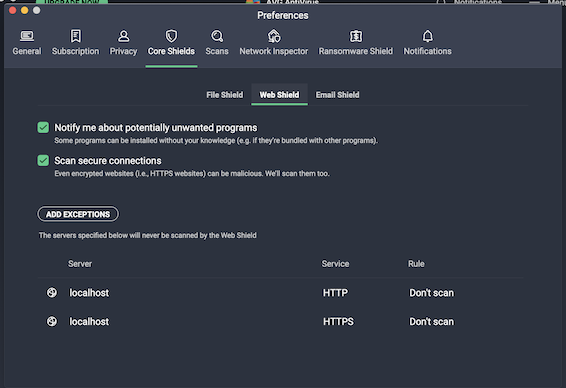

## port allocation
starting in 50000 range
C4 containers will jump by 100s 
core service will be undefined/ephemeral/dynamically selected by docker e.g. postgres & kafka

## Creating a self signed cert for ingress
The ingress folder contains a key and certificate for SSL termination in an nginx reverse proxy.
This key and cert should only be used for the local development environment. This is done to
reduce the burden on anyone trying to run the solution locally but it does mean that you're
being asked to trust a certificate from a public repository 
(see [Trusting the certificate](#trusting-the-certificate))

If you would like to create your own certificate you can execute the commands below to generate
you're own unique certificate that you can then trust.

```
openssl genrsa -out ./ingress/hostname.key 4096
openssl rsa -in ./ingress/hostname.key -out ./ingress/hostname-key.pem
openssl req -new -key ./ingress/hostname-key.pem -out ./ingress/hostname-request.csr -subj "/C=GB/O=UK Home Office/CN=*.callisto.localhost"  -sha256
openssl x509 -req -extensions v3_req -days 14600 -in ./ingress/hostname-request.csr -signkey ./ingress/hostname-key.pem -out ./ingress/hostname-cert.crt -extfile ./ingress/openssl.cnf -sha256
```

## Trusting the certificate

These are the steps for trusting the certificate used by the nginx reverse proxy. These steps work
for the certificate used by the site so it doesn't matter if you used the provided certificate
or chose to generate your own unique certificate.

### Issues

An issue with anti-virus software was noticed on Chrome on MacOS. The anti-virus software
was scanning https traffic. To achieve this it issues its own certificate in order to decrypt the
traffic but because the anti-virus software doesn't trust the self signed certificate, the
trust chain is broken. Depending on the software, you may be able to configure it to trust the
certificate or you may need to add `localhost` as an exception.

In this case the software was AVG Antivirus and `localhost` was added as an exception. This is
done through Preferences > Core Shields > Web Shield > Add exceptions.



### MacOS + Chrome
* Locate the certificate [hostname-cert.crt](./ingress/hostname-cert.crt) and open it
* This will import the certificate into your Keychain.
* Open Keychain and locate the certificate.
* Expand the trust section and change `When using this certificate` to `Always Trust`
* Close the window to save the changes
* Refresh your browser window
